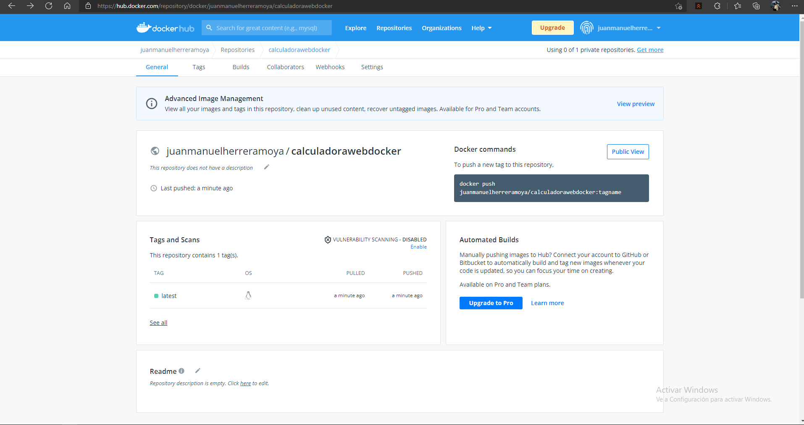
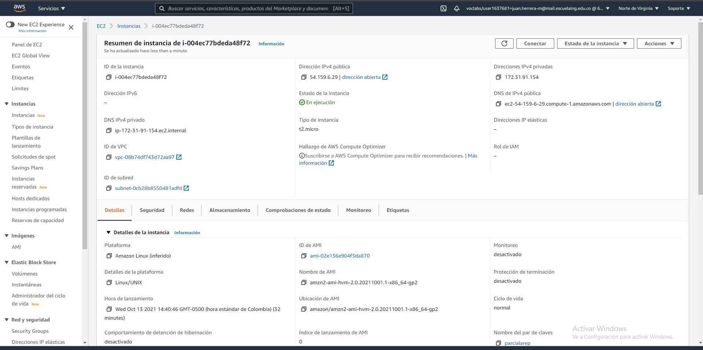
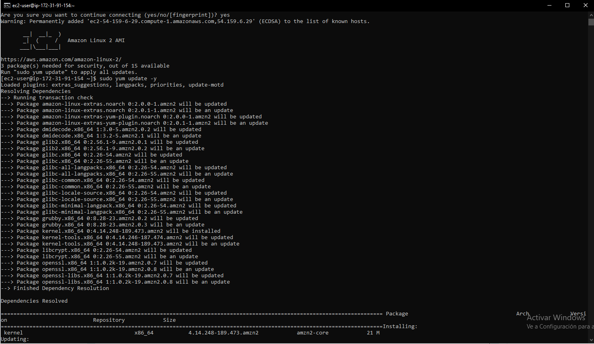
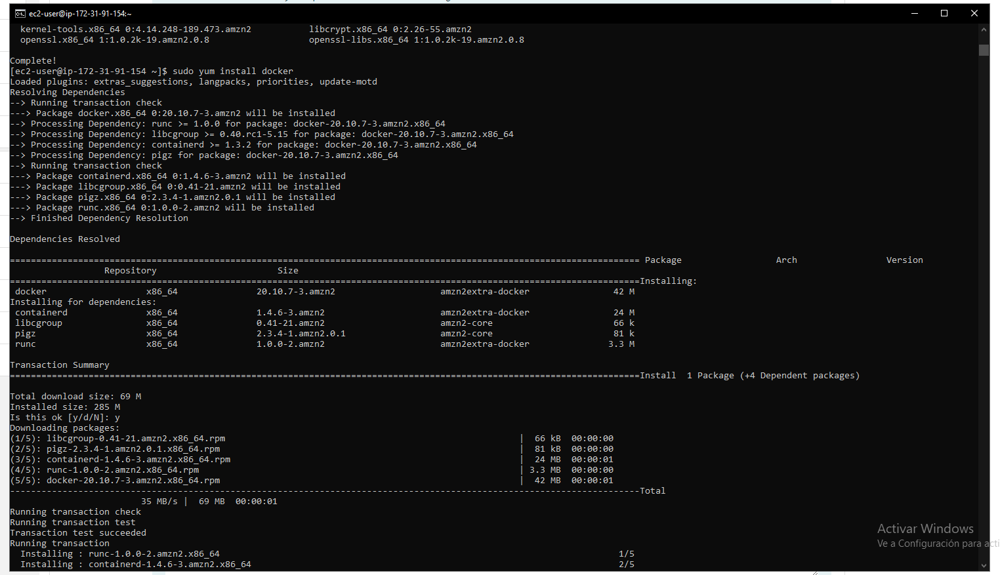
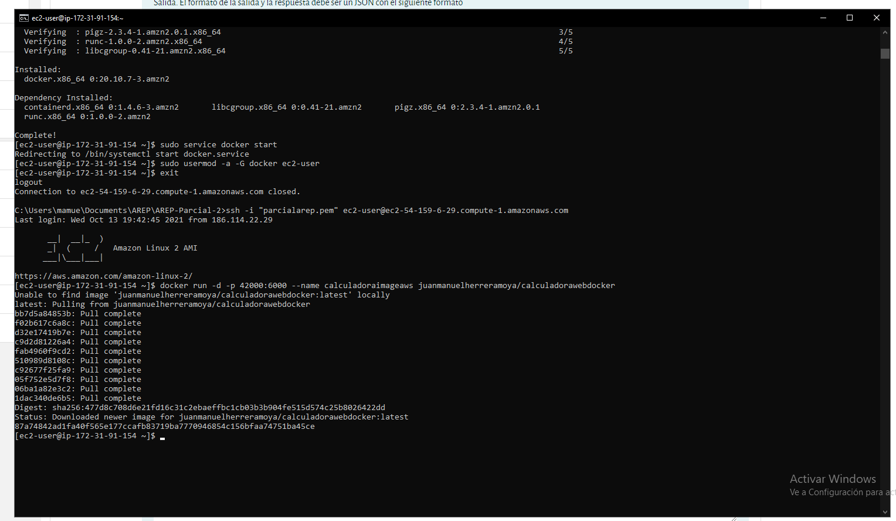
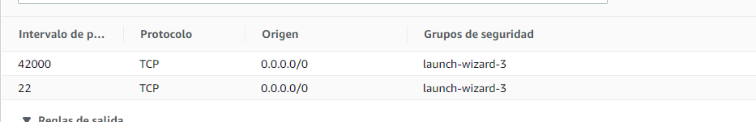
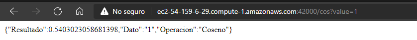
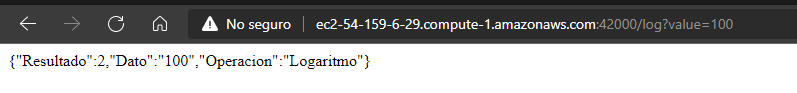

# AREP-PARCIAL-2
### En este Parcial se busca generar una instancia en AWS con ayuda de Docker para poder desplegar la calculadora con las debidas funciones, acontinuacion mostrare los pasos:

1. Tiene que crear la calculadora en JAVA, para eso tiene que crear un repositorio con mvn. 
2. al tener la calculadora creada en JAVA, vamos a crear el docker a continuacion mostrare los comandos que yo ejectue

"docker build --tag dockercalculadora ."
---------------------------------------
"docker run -d -p 34000:6000 --name Calculadoracontainer dockercalculadora "
---------------------------------------
"docker-compose up -d"
---------------------------------------

al tener esto, crearemos en DockerHun un repositorio nuevo el cual yo lo nombre: calculadorawebdocker
luego enlazo el nuevo repo con la instancia que cree local de docker

docker tag dockercalculadora juanmanuelherreramoya/calculadorawebdocker .

ahora hago push de mi instancia 
docker push juanmanuelherreramoya/calculadorawebdocker:latest

--------------------------------------
### La segunda parte es la creacion del AWS EC2 

1. tenemos que crear una instancia EC2 en AWS 

2. Actualizaremos e instalaremos Docker en esta maquina virtual EC2.

actualizacion del sistema operativo
---------------------------------

-----------------------------------
instalacion de Docker 
----------------------------------

----------------------------------

3. Luego de tener instalado docker, clonaremos el repo y asi podremos tener la imagen de la calculadora antes desarrollada

4. Abriremos los puertos de nuestro EC2 dandole acceso a cualquier computador para entrar, detras de este proceso, estamos asiganandole a docker que cuando reciba una peticion por el puerto 42000, lo asigne al puerto 6000

5. Para finalizar podremos entrar a la URL que nos da el container como IPv4 , en mi caso es:

# ec2-54-159-6-29.compute-1.amazonaws.com

## Tercer Parte

El funcionamiento de esta calculadora es sencilla, vamoa a mandar una peticion a nuestra maquina , el cual con la imagen podra hacer la operacion correspondiente que requiera

Primero veremos el Coseno 

Ahora el funcionamiento con el Logaritmo base 10

## Video

Anexo link a youtube del video de comprobacion 
-------------------------------
https://youtu.be/O9w9TGbVQSM
------------------------------

#Autor
# Juan Manuel Herrera Moya 

